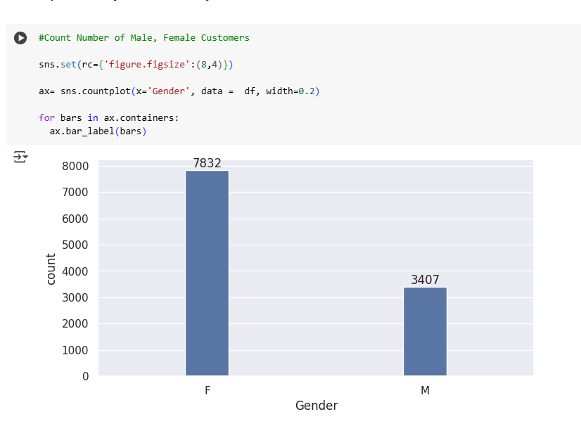

# 📊 Vertex Nexus Sales EDA Project

Exploratory Data Analysis (EDA) on sales data from **Vertex Nexus**, aimed at uncovering key trends Customer-wise, State-wise and Product-wise. This project demonstrates my Python data analysis workflow—from data cleaning to Analysis.

## 🧠 Overview

This project explores sales patterns to answer questions like:
- How do sales vary across different Customer Category?
- Which regions generate the most revenue?
- What product categories are driving growth?
- Which aspects should the company focus on to drive growth and improve sales?

## 🛠️ Tools & Technologies

- **Python** 🐍  
  - pandas for data manipulation  
  - matplotlib, seaborn for visualizations  
  - plotly for interactive charts  
- **Google Colab** for iterative analysis  
- **GitHub** for Project Presentation   

## About Business

Vertex Nexus Pvt Ltd  is a dynamic, multi-sector enterprise based in India. It operates across several high-impact industries and deals in multiple products.

## Objective

The Vertex Nexus sales team has observed several pressing issues impacting overall business growth:
- Stagnant Sales for Specific Products: Certain products have not shown consistent growth, prompting concerns about market relevance, pricing, or promotional strategy.
- Underperforming Geographic Areas: Specific regions are contributing below-average revenue, indicating potential issues in market penetration, channel effectiveness, or local demand.
- Limited Customer Segmentation Insight: The company seeks to better understand its customer base—particularly identifying high-value customers and behavioral patterns—to unlock new sales opportunities and refine targeting strategies
As a data analyst, my goal is to perform Exploratory Data Analysis (EDA) on the Vertex Nexus sales dataset to uncover insights and provide solutions.

## 🧹 Data Cleaning & Transformation

- Removed the Status and unnamed1 column from the data as they were empty
- Removed Null Values from Amount Column
- Changed The Amount Column data type as integer

## 📈 Key Insights

# Explored Data on the basis of customers

- Calculated Gender-wise Revenue and Count of Customers Chart - Females account for more than 50% of the total customers and spent more than 70 million whereas Males spent only around 30 million

